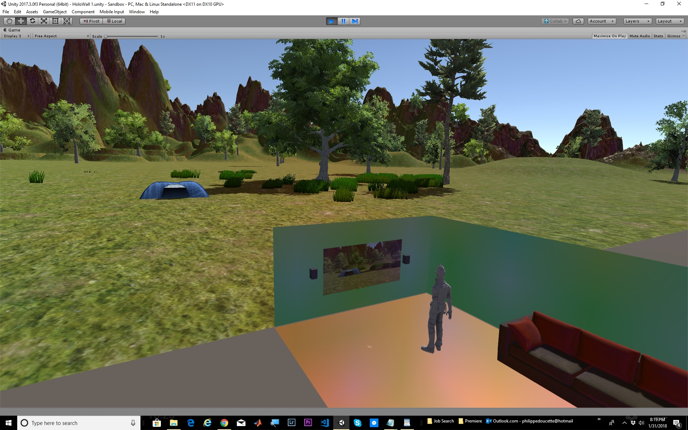

# Synthetic-Portal

The project is a Powerwall display, built in Unity.
The concept is to create a 3D wall display that does not require the user to wear glasses, a HMD, or any other tracking device. Ordinary people could enter the viewspace and be presented with a convincing display of distant landscapes, as if they were looking out a window or balcony.

An Intel RealSense camera is used to identify human features to locate the user's face within its 3D space. This data point is used to recalculate the render perspective. Sound is also rendered so that point sounds seem to come from their visual location, even though stereo speakers are used.
